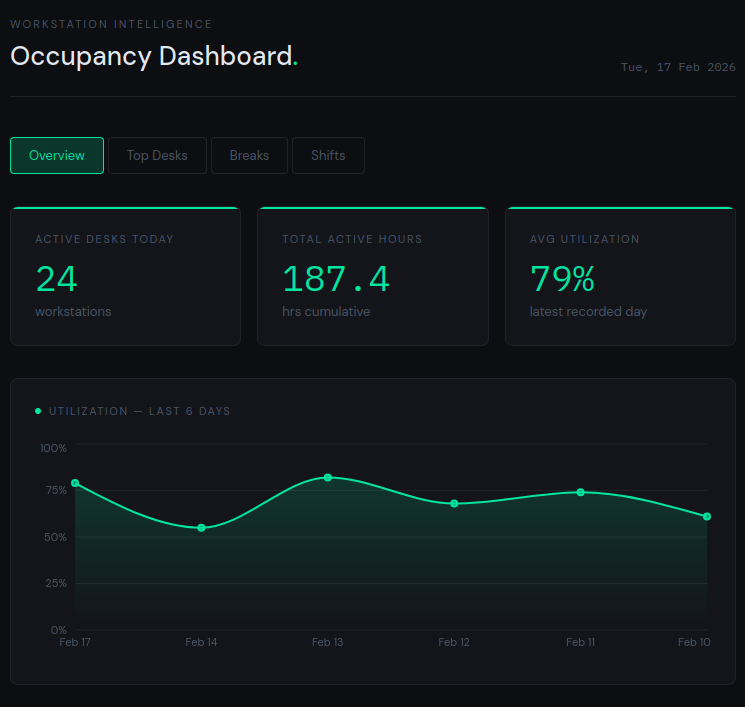
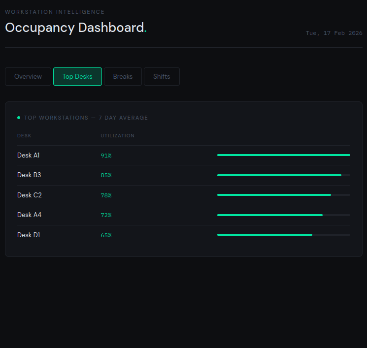
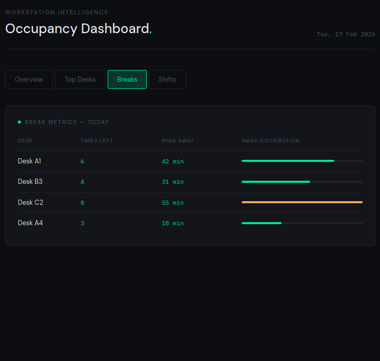
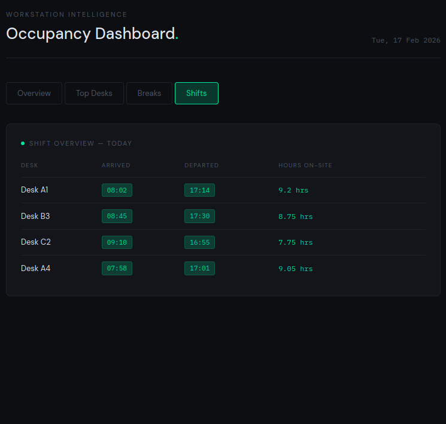

# Workstation Occupancy Analytics API

## Endpoints

All endpoints are prefixed with `/api/v1/analytics`.

### `GET /summary/today`

Returns the total number of active desks and cumulative active hours for the current day.

**Query params**

| Param    | Type | Default | Description     |
|----------|------|---------|-----------------|
| `org_id` | int  | `1`     | Organisation ID |

**Response**

```json
{
  "active_desks_count": 24,
  "total_office_active_hours": 187.4
}
```

---

### `GET /utilization/history`

Returns average office utilization percentage, grouped by day, in descending order.

**Query params**

| Param    | Type | Default | Description              |
|----------|------|---------|--------------------------|
| `org_id` | int  | `1`     | Organisation ID          |
| `limit`  | int  | `30`    | Number of days to return |

**Response**

```json
[
  { "analytics_date": "2026-02-17", "avg_office_utilization": 79.5 },
  { "analytics_date": "2026-02-14", "avg_office_utilization": 55.0 }
]
```

---

### `GET /workstations/top`

Returns the most utilized desks averaged over the last N days.

**Query params**

| Param   | Type | Default | Description           |
|---------|------|---------|-----------------------|
| `days`  | int  | `7`     | Lookback window       |
| `limit` | int  | `5`     | Number of desks to return |

**Response**

```json
[
  { "workstation_name": "Desk A1", "avg_utilization": 91.0 },
  { "workstation_name": "Desk B3", "avg_utilization": 85.0 }
]
```

---

### `GET /workstations/breaks/today`

Returns break counts and total time away from desk for each workstation today, ordered by most time away.

**No query params.**

**Response**

```json
[
  {
    "workstation_name": "Desk C2",
    "total_times_left_desk": 8,
    "total_minutes_away": 55.0
  }
]
```

---

### `GET /workstations/shifts/today`

Returns first arrival time, last departure time, and total hours on-site for each workstation today.

**No query params.**

**Response**

```json
[
  {
    "workstation_name": "Desk A1",
    "first_seen_time": "08:02:00",
    "last_present_time": "17:14:00",
    "total_hours_on_site": 9.2
  }
]
```

---

### `GET /workstations/{desk_name}/attendance`

Returns arrival time, exit time, and total hours for a specific desk on a given date.

**Path params**

| Param       | Type   | Description       |
|-------------|--------|-------------------|
| `desk_name` | string | Name of the desk  |

**Query params**

| Param        | Type   | Default | Description            |
|--------------|--------|---------|------------------------|
| `query_date` | date   | today   | Date in `YYYY-MM-DD` format |
| `org_id`     | int    | `1`     | Organisation ID         |

**Example**

```
GET /api/v1/analytics/workstations/Desk A1/attendance?query_date=2026-02-17
```

**Response**

```json
{
  "workstation_name": "Desk A1",
  "analytics_date": "2026-02-17",
  "arrival_time": "08:02:00",
  "exit_time": "17:14:00",
  "total_hours": 9.2
}
```

**Returns `404`** if no data exists for the given desk and date.

---

## Error Responses

| Status | Meaning                                      |
|--------|----------------------------------------------|
| `404`  | No data found for the requested desk / date  |
| `500`  | Database connection failed                   |

---

## Dashboard Screenshots

The `dashboard.jsx` React component provides a visual interface over this API. It has four tabs, each mapping to a set of endpoints.

### Overview
KPI summary cards (active desks, total hours, avg utilization) and a utilization area chart powered by `/summary/today` and `/utilization/history`.



### Top Desks
Bar-ranked table of most utilized workstations over the last 7 days, powered by `/workstations/top`.



### Breaks
Break frequency and time-away metrics per desk for today, powered by `/workstations/breaks/today`. Bars turn amber when a desk exceeds 45 minutes away.



### Shifts
First arrival and last departure times with total hours on-site, powered by `/workstations/shifts/today`.



---

## Database Table

All endpoints query the `workstation_daily_analytics` table. The expected columns are:

| Column               | Type      |
|----------------------|-----------|
| `org_id`             | integer   |
| `workstation_name`   | text      |
| `analytics_date`     | date      |
| `first_seen_time`    | time      |
| `last_present_time`  | time      |
| `active_seconds`     | integer   |
| `utilization_percent`| numeric   |
| `missing_count`      | integer   |
| `missing_duration`   | numeric   |
